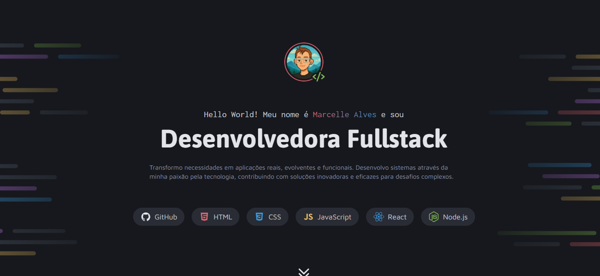

# Portfólio Dev - Marcelle Alves

## 🚀 Sobre o Projeto
Este projeto é um <strong>portfólio pessoal</strong> criado como um desafio na formação <strong>Full-Stack da Rocketseat</strong>. O objetivo principal é servir como uma vitrine digital para meus projetos e habilidades. O site é o meu cartão de visitas online, onde apresento um resumo da minha trajetória e os trabalhos que tenho desenvolvido.

A base do projeto foi construída para demonstrar minha capacidade de criar interfaces responsivas, otimizadas e visualmente atraentes, focando em uma experiência de usuário fluida.

## ✨ Principais Funcionalidades
<li><strong>Design Responsivo:</strong> O layout foi projetado para se adaptar a diferentes tamanhos de tela (desktop, tablet e mobile), utilizando @media queries para garantir que a navegação e a visualização sejam fluidas em qualquer dispositivo.</li>

<li><strong>Animações e Interatividade:</strong> Adicionei transições e efeitos de hover para criar uma experiência de usuário mais interativa e profissional, com destaque para a animação sutil nos botões.</li>

<li><strong>Estrutura Otimizada:</strong> O código está organizado de forma a ser limpo e fácil de manter, utilizando seletores específicos e uma estrutura semântica em HTML.</li>

## 🛠️ Tecnologias Utilizadas
<li><strong>HTML5</strong></li>
<li><strong>CSS3</strong></li>
<li><strong>@media queries</strong></li>

## 📁 Projeto
Se você quiser explorar o código e contribuir, pode clonar o repositório para sua máquina local.

## ➡️ Acesse o Portfólio Online
Para visualizar este projeto online, basta acessá-lo através do GitHub Pages, no link abaixo: [Portfólio Dev](devchinninto.github.io/portfolio_dev)

## ✉️ Contato
   [LinkedIn](https://www.linkedin.com/in/marcelle-alves-724608315/)
  
 
[Github](github.com/devchinninto)